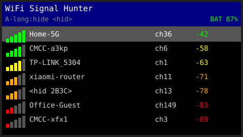
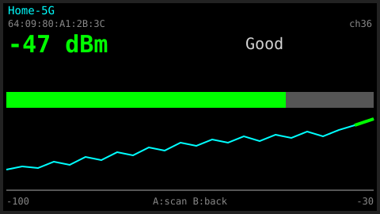

# WiFi Signal Hunter 📡

**A WiFi signal-strength tracker for the M5StickS3 — find where your AP really is, by sight and by sound.**
为 M5StickS3 打造的 WiFi 信号寻踪器——用眼睛看、用耳朵听，找到信号源的真实位置。

| 列表页 List View | 追踪页 Track View |
|:---:|:---:|
|  |  |
| 扫描列表：稳定顺序 / 信号格 / 信道 / dBm / 电量 | 锁定信号源：4Hz 实时读数 / 历史曲线 / 盖革式蜂鸣 |

> 上图为 UI 模拟示意图（依固件实际布局绘制）。

## 它能做什么

拿着这台小棒子在家里走一圈：

- **列表页**：循环扫描周边 WiFi（~2.5s 一轮），首扫按信号排序后**顺序固定**，
  新信号源追加、消失 3 轮移除；标题栏显示扫描状态与实时电量；长按 A 过滤隐藏网络
- **追踪页**：按 BSSID 锁定任一信号源，**单信道快扫每秒刷新 4~5 次**——
  大字号 dBm、彩色信号条、历史曲线，以及盖革计数器式蜂鸣：
  **离信号源越近响得越急**，揣在兜里也能凭声音摸到 AP 位置
- **重力翻转**：BMI270 检测横屏方向，倒拿 180° 屏幕自动转
- 防丢机制：追踪中每 15s 全扫校准；AP 换信道或连续丢失自动重找

设备：M5Stack M5StickS3（SKU K150，ESP32-S3-PICO-1-N8R8，BMI270 IMU、
ES8311 音频、红外收发、1.14" 240×135 LCD、蜂鸣喇叭、250mAh 电池）。
同类 ESP32-S3 + LCD + 按键的设备稍改引脚也能跑。

| 按键 | 列表页 | 追踪页 |
|---|---|---|
| BtnA（正面大键）短按 | 下移选择（可滚动） | 立即全扫 |
| BtnA 长按 0.6s | 显示/隐藏隐藏 SSID 信号源 | — |
| BtnB（侧键） | 进入追踪 | 返回列表 |

## 直接烧录（免编译）

到 [Releases](https://github.com/E2ern1ty/wifi-signal-hunter/releases) 下载
`wifi-signal-hunter-vX.Y.Z-flashable.zip`，解压后：

```bash
# 安装 esptool（任选其一）
pip install esptool          # 或 brew install esptool

# 一条命令烧录（按实际串口改 /dev/cu.usbmodemXXXX）
esptool --chip esp32s3 --port /dev/cu.usbmodem1101 --baud 921600 \
  write_flash 0x0 full-image-vX.Y.Z.bin
```

烧完**拔插一次 USB** 即开机运行（ESP32-S3 的 USB 下载模式需断电退出）。
M5StickS3 出厂固件可用本仓库 `restore_stock.sh` 还原（需自备份镜像）。

## 从源码构建

```bash
arduino-cli compile --fqbn \
  'esp32:esp32:esp32s3:USBMode=hwcdc,CDCOnBoot=cdc,PSRAM=opi,FlashSize=8M,PartitionScheme=default_8MB' \
  wifi_scanner

arduino-cli upload -p /dev/cu.usbmodem1101 --fqbn \
  'esp32:esp32:esp32s3:USBMode=hwcdc,CDCOnBoot=cdc,PSRAM=opi,FlashSize=8M,PartitionScheme=default_8MB' \
  wifi_scanner
```

依赖：esp32 core ≥3.x + M5Unified（板级自动识别 M5StickS3）。

串口监视：`screen /dev/cu.usbmodem1101 115200`（输出 `[scan]` / `[track]` 日志）

> ⚠️ **macOS 串口注意**：这台 Mac 打开串口瞬间会拉高 DTR/RTS，可能把 S3 踢进下载模式
> （屏幕灭、串口只打印 "waiting for download"）。恢复方法：**拔插一次 USB** 即可正常开机。
> 刷完机后也需要拔插一次 USB 才会启动新固件（S3 的 USB 下载模式只有断电能清）。

### 还原出厂固件

出厂固件（UIFlow2）完整备份：`/tmp/stick_s3/flash_full.bin`（8MB，建议转存到安全位置）。

```bash
./restore_stock.sh            # 默认 /dev/cu.usbmodem1101
./restore_stock.sh /dev/cu.XX # 指定其他串口
```

## 相关资料

- [chat-stick](https://github.com/steveruizok/chat-stick) — M5StickS3 原生 AI 语音对话棒（参考了它的按键/板级配置结论）
- [M5Unified](https://github.com/m5stack/M5Unified) / [M5GFX](https://github.com/m5stack/M5GFX)
- [M5Stack 官方文档](https://docs.m5stack.com)
